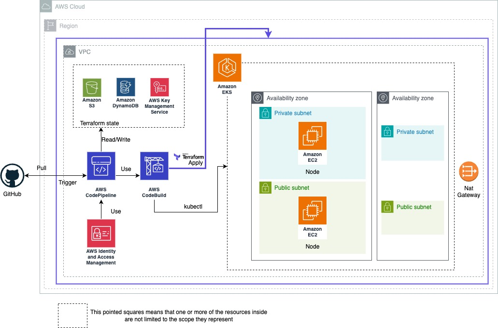

# py-grpc-aws-eks-tf
Python gRPC, AWS EKS and associated cloud resources Terraform.

## Introduction
This project exemplified a Terraform project, a gRPC Python application and the assosiated resources (templates, scripts, definition files, ...) to deploy the application and its infrastructure with CI/CD.
---
## Architecture Diagram

---
## Installation / Deployment Guide

### Requirements
Terraform >= v1.3.6

aws-cli >= 2.7.21

Python >= 3.9.11

Note: You must have configured your AWS account credentials on the console.
### Clone
```
git clone https://github.com/jpmosquerac/py-grpc-aws-eks-tf.git
cd py-grpc-aws-eks-tf
```
After that create your own repository, copy the files and set up all the variables in `variables.tf` and `backend.tf` but **DO NOT push the changes**.

### Set up remote state
To set up the remote state are some resources needed to be deployed before. In order to do it this are the steps:
1. In the file `main.tf` comment all the modules except the backend one in this way:
```
module "backend" {
  source = "./modules/backend"

  aws_account = data.aws_caller_identity.current.account_id
  aws_region  = var.aws_region

  aws_environment               = var.aws_environment
  s3_bucket_name                = var.s3_bucket_name
  dynamodb_table_name           = var.dynamodb_table_name
  dynamodb_read_capacity_units  = var.dynamodb_read_capacity_units
  dynamodb_write_capacity_units = var.dynamodb_write_capacity_units
  iam_group_name_rw_access      = var.iam_group_name_rw_access
  iam_group_name_ro_access      = var.iam_group_name_ro_access
}

<!-- module "codepipeline" {
    ...
}

module "network" {
    ...
}

module "eks" {
    ...
} -->
```
2. Comment all inside `backend.tf` in this way: 
```
<!-- terraform {
  backend "s3" {
    bucket         = "terraform-state-XXXXXXXXXX"
    key            = "terraform-state"
    region         = "us-east-1"
    encrypt        = true
    dynamodb_table = "terraform-lock"
  }
} -->
```
3. Execute the commands to deploy terraform:
```
terraform init
terraform plan
terraform apply
```
4. Once it's done uncomment the lines in the `backend.tf` file and execute the following command `terraform init`; you must accept copy the state.
5. Uncomment the lines in the `main.tf` file.
---
### Deploy codepipeline module
1. In the `main.tf` file comment the other modules except backend and codepipeline in this way:
2. **Push the changes to your remote repository**
```
module "backend" {
  source = "./modules/backend"

  aws_account = data.aws_caller_identity.current.account_id
  aws_region  = var.aws_region

  aws_environment               = var.aws_environment
  s3_bucket_name                = var.s3_bucket_name
  dynamodb_table_name           = var.dynamodb_table_name
  dynamodb_read_capacity_units  = var.dynamodb_read_capacity_units
  dynamodb_write_capacity_units = var.dynamodb_write_capacity_units
  iam_group_name_rw_access      = var.iam_group_name_rw_access
  iam_group_name_ro_access      = var.iam_group_name_ro_access
}

module "codepipeline" {
    ...
}

<!-- module "network" {
    ...
}

module "eks" {
    ...
} -->
```
3. Now to deploy execute the terraform apply commands:
```
terraform init
terraform plan
terraform apply
```
It is probably to fail the excution of the pipeline or the deploy of some resources due to are resources referenced on it that could not be created at that time. Ignore it if fails.
4. Uncomment the lines in the `main.tf` file.
### Final deployment
To finish de deployment verify is not lines commented and **Push the changes to your remote repository** it will trigger the pipeline and update it self to deploy the other modules.

It is probably to fail the excution of the pipeline or the deploy of some resources due to are resources referenced on it that could not be created at that time. If it fails retry the failed stage in codepipeline.

After it finishes you would be able to see all the deployed resources in your web console.