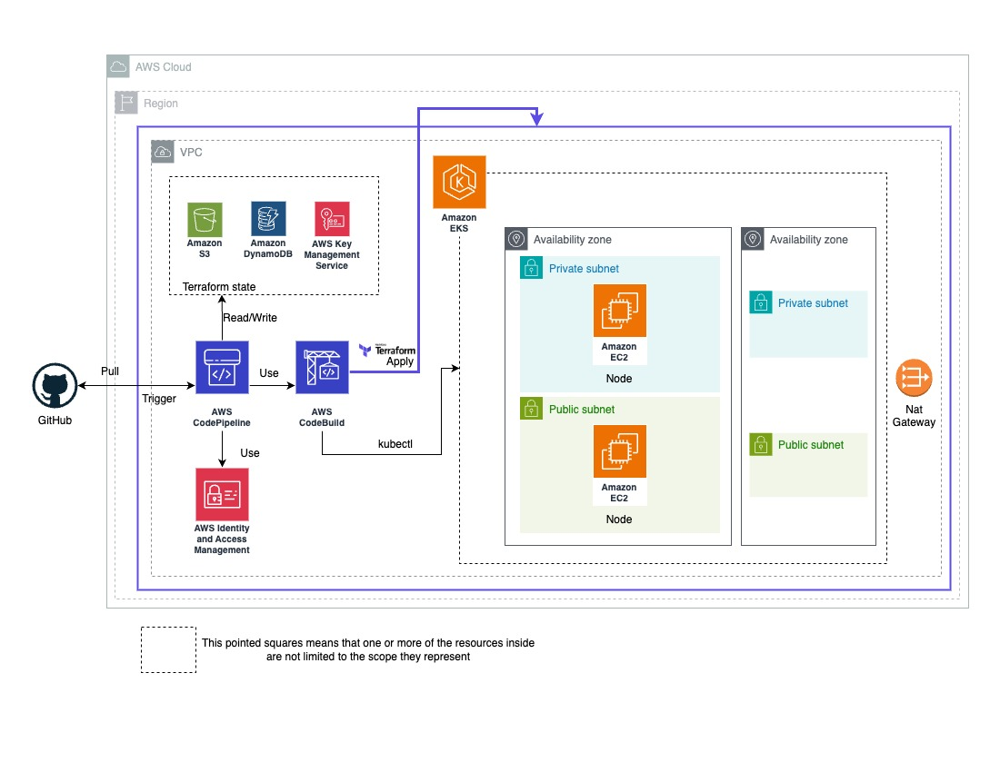

# py-grpc-aws-eks-tf
### Python gRPC, AWS EKS and associated cloud resources Terraform

## Introduction
This project exemplified a Terraform project, a gRPC Python application and the assosiated resources (templates, scripts, definition files, ...) to deploy the application and its infrastructure with CI/CD.

## Architecture Diagram

## Installation / Deployment Guide

### Requirements
Terraform >= v1.3.6
aws-cli >= 2.7.21
Python >= 3.9.11

Note: You must have configured your AWS account credentials on the console.

### Clone
´´´
git clone https://github.com/jpmosquerac/py-grpc-aws-eks-tf.git
cd py-grpc-aws-eks-tf
´´´
After that create your own repository, copy the files and set up all the variables in ´variables.tf´ and ´backend.tf´

### Set up remote state
To set up the remote state are some resources needed to be deployed before. In order to do it this are the steps:
1. In the file ´main.tf´ comment all the modules except the backend one in this way:
´´´
module "backend" {
  source = "./modules/backend"

  aws_account = data.aws_caller_identity.current.account_id
  aws_region  = var.aws_region

  aws_environment               = var.aws_environment
  s3_bucket_name                = var.s3_bucket_name
  dynamodb_table_name           = var.dynamodb_table_name
  dynamodb_read_capacity_units  = var.dynamodb_read_capacity_units
  dynamodb_write_capacity_units = var.dynamodb_write_capacity_units
  iam_group_name_rw_access      = var.iam_group_name_rw_access
  iam_group_name_ro_access      = var.iam_group_name_ro_access
}

<!-- module "codepipeline" {
    ...
}

module "network" {
    ...
}

module "eks" {
    ...
} -->
´´´
2. Comment all inside ´backend.tf´ in this way: 
´´´
<!-- terraform {
  backend "s3" {
    bucket         = "terraform-state-XXXXXXXXXX"
    key            = "terraform-state"
    region         = "us-east-1"
    encrypt        = true
    dynamodb_table = "terraform-lock"
  }
} -->
´´´
3. Execute the commands to deploy terraform:
´´´
terraform init
terraform plan
terraform apply
´´´
4. Once it's done uncomment the lines in the ´backend.tf´ file and execute the following command ´terraform init´; you must accept copy the state.
5. Uncomment the lines in the ´main.tf´ file
